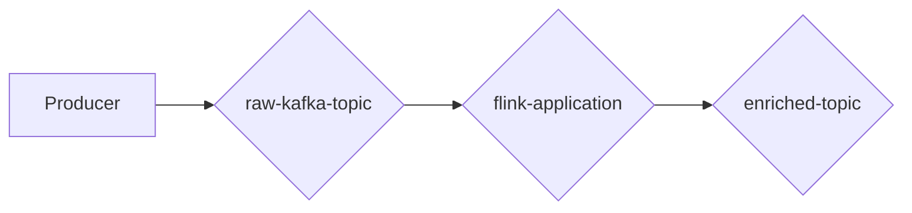

# Project: Stream Processing with Kafka and Flink

The project, **learning-stream-processing**, demonstrates the use of
**Apache Kafka** and **Apache Flink** to process a stream of numerical data.
The primary objective is to build a system that reads raw events from a Kafka
topic, processes them using a Flink application, and writes the results to an
output topic.

-----

## 🎯 Goal

The system's goal is to **pair numbers that sum to 12**. 🤝

* The system ingests a stream of single-number events from a **raw Kafka topic**.
* The **Flink application** filters out any corrupted data (numbers outside
the 0-12 range).
* It then pairs valid numbers that add up to 12.
* Each valid pair is written as an event to an **enriched output topic**.

-----

## 🏛️ Architecture

The system follows a simple, linear data flow:

* **Producer:** Generates a stream of numbers from 0 to 12 (with occasional
out-of-range data for testing).
* **raw-kafka-topic:** The input topic where the raw, unprocessed data stream
is stored.
* **flink-application:** The core processing component that consumes from the
raw topic, filters invalid data, and performs the pairing logic.
* **enriched-topic:** The output topic containing the final, processed pairs of numbers.

-----

## 🛠️ Plan

This project will be developed in three main steps:

1. **Set up the Kafka cluster**: Spin up the necessary Kafka brokers and
Zookeeper instance to handle the event streams.
2. **Develop the producer application**: Create an application to generate and
send numerical events to the **raw-kafka-topic**.
3. **Develop the Flink application**: Build the Flink job that will consume
the data, apply the business logic (filtering and pairing), and produce the
results to the **enriched-topic**.
