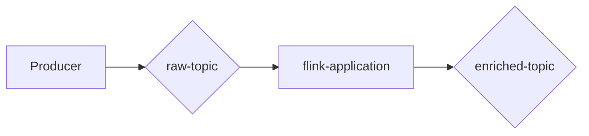

# Project: Stream Processing with Kafka and Flink

The project, **learning-stream-processing**, demonstrates the use of
**Apache Kafka** and **Apache Flink** to process a stream of numerical data.
The primary objective is to build a system that reads raw events from a Kafka
topic, processes them using a Flink application, and writes the results to an
output topic.

-----

## 🎯 Goal

The system's goal is to **pair numbers that sum to 12**. 🤝

* The system ingests a stream of single-number events from a **raw Kafka topic**.
* The **Flink application** filters out any corrupted data (numbers outside
the 0-12 range).
* It then pairs valid numbers that add up to 12.
* Each valid pair is written as an event to an **enriched output topic**.

-----

## 🏛️ Architecture

The system follows a simple, linear data flow:



* **Producer:** Generates a stream of numbers from 0 to 12 (with occasional
out-of-range data for testing).
* **raw-topic:** The input topic where the raw, unprocessed data stream
is stored.
* **flink-application:** The core processing component that consumes from the
raw topic, filters invalid data, and performs the pairing logic.
* **enriched-topic:** The output topic containing the final, processed pairs of numbers.

-----

## 🛠️ Plan

This project will be developed in three main steps:

1. **Set up the Kafka cluster**: Spin up the necessary Kafka brokers to handle
the event streams.
2. **Develop the producer application**: Create an application to generate
and send numerical events to the **raw-topic**.
3. **Develop the Flink application**: Build the Flink job that will consume
the data, apply the business logic (filtering and pairing), and produce
the results to the **enriched-topic**.

-----

## ▶️ Getting Started

Follow these steps to build and run the stream processing demo:

### 1\. **Build the Flink Application**

First, navigate to the `flink-data-processor` directory and build the Flink
application using Maven. This command compiles the Java code and packages it
into a JAR file.

```sh
cd flink-data-processor && mvn clean package
```

### 2\. **Copy the JAR to the Flink Volume**

The Flink Docker container needs access to the application JAR. Copy
the compiled JAR file from the `target` directory into the shared Docker volume (`volumes/flink-usrlib`).

```sh
cp flink-data-processor/target/flink-data-processor-1.0-SNAPSHOT.jar volumes/flink-usrlib/flink-data-processor-1.0-SNAPSHOT.jar
```

### 3\. **Start the Clusters**

Use Docker Compose to start all the necessary services, including **Kafka**,
**Flink JobManager**, **Flink TaskManager**, and **Kafka UI**. The `-d` flag
runs the containers in detached mode.

```sh
sudo docker compose up -d
```

### 4\. **Run the Data Producer**

Navigate to the `producer` directory and run the Rust producer application.
This will start generating a stream of numbers and corrupted data, sending them
to the `raw-topic` in Kafka.

```sh
cd producer && cargo run --release
```

### 5\. **Submit the Flink Job**

Finally, submit the Flink application JAR to the Flink JobManager.
The `docker exec` command runs the Flink CLI tool inside the `jobmanager` container.
The command-line arguments provide the necessary configuration, such as Kafka
server details and topic names.

```sh
sudo docker exec -it jobmanager flink run \
     /opt/flink/usrlib/flink-data-processor-1.0-SNAPSHOT.jar \
     --pairSum 12 \
     --bootstrapServers kafka:9094 \
     --rawTopic raw-topic \
     --groupId my-group \
     --enrichedTopic enriched-topic \
     --DLQ raw-events-dlq
```

### 6\. **Monitor the Demo**

Once all components are running, you can monitor the data and the Flink job
through the web UIs:

* **Kafka UI**: View the events in the `raw-topic` and `enriched-topic` at `http://localhost:8080`.
* **Flink Dashboard**: Monitor the Flink job status, metrics, and logs at `http://localhost:8081`.
